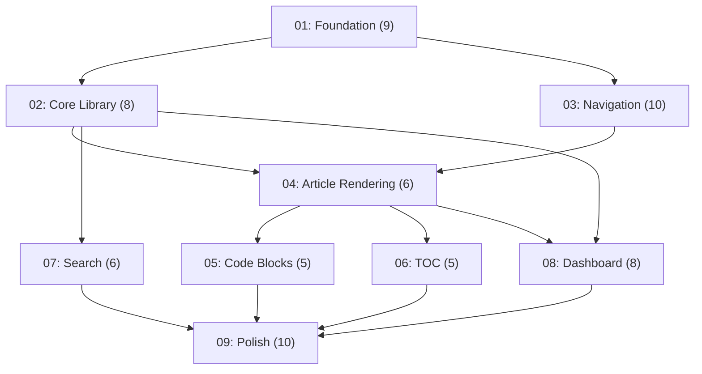

# Plan: Mine Knowledge Base — Liquid Glass Edition
Created: 2026-05-22 08:50
Updated: 2026-05-22 09:00
Status: 🟡 In Progress

## Overview
Biến `mine-app-fe` (Next.js 16 + TailwindCSS v4) thành Personal Knowledge Base / Second Brain.
Lưu kiến thức dưới dạng file `.md` trong `docs/knowledge/`, hiển thị trên web với giao diện **Liquid Glass** lấy cảm hứng từ Apple WWDC 2025.

## Goal
- Tạo web app tĩnh (no backend) để lưu trữ và học tập kiến thức cá nhân
- Giao diện Liquid Glass premium, dark mode mặc định
- Sidebar cha-con, render markdown đẹp, full-text search, TOC, progress tracking

## Scope

### In Scope
- Liquid Glass design system (CSS variables, glass utilities, gradient mesh)
- File-based markdown processing (frontmatter YAML + render HTML)
- Sidebar tree navigation (folder = cha, file = con)
- Markdown content rendering (typography, code blocks, tables, blockquotes)
- Syntax highlighting + copy code button
- Table of Contents (scroll spy)
- Full-text search modal (Ctrl+K, fuzzy search)
- Dark/Light mode toggle (localStorage persist)
- Dashboard trang chủ (stats, recent articles)
- Breadcrumb navigation
- Article metadata (tags, difficulty, status)
- Reading progress bar
- Folder listing page
- Responsive mobile/tablet

### Out of Scope
- Backend / API / Database
- Authentication / Multi-user
- CMS editor trên web (viết .md bằng editor ngoài)
- Comments / Collaboration
- Spaced repetition / Quiz system (v2)

## Actors
- Anh (personal use) — viết .md, đọc bài, track progress

## Core Entities
- **KnowledgeFolder**: Chủ đề cha, map 1:1 với folder trong `docs/knowledge/`
- **KnowledgeArticle**: Bài viết, file `.md` với YAML frontmatter

## Assumptions
- Dự án dùng cá nhân, không cần auth
- Số bài viết < 500 (đủ cho static generation)
- Progress tracking dùng localStorage
- TailwindCSS v4 giữ nguyên
- Deploy target: Vercel / GitHub Pages

## Risks
- `backdrop-filter` performance → Chỉ dùng cho nav elements
- Search index lớn → Lazy load, chỉ index metadata + excerpt

## Acceptance Criteria
- [ ] Mở web → thấy dashboard với stats + recent articles
- [ ] Sidebar hiển thị đúng tree cha-con từ folder structure
- [ ] Click bài → markdown rendered đẹp, code highlighted, copy button hoạt động
- [ ] Ctrl+K → search modal, fuzzy search, keyboard navigation
- [ ] TOC bên phải, scroll spy highlight heading đang đọc
- [ ] Dark/Light toggle hoạt động, persist khi reload
- [ ] Mobile responsive: sidebar collapse, content full width
- [ ] `pnpm build` thành công

## Phases

| Phase | Name | Tasks | Status | Depends On |
|-------|------|-------|--------|------------|
| 01 | Foundation — Dependencies & Design System | 9 | ✅ Complete | - |
| 02 | Core Library & Sample Content | 8 | ✅ Complete | 01 |
| 03 | Shell Layout & Navigation | 10 | ✅ Complete | 01 |
| 04 | Article Page & Markdown Rendering | 6 | ✅ Complete | 02, 03 |
| 05 | Code Blocks & Reading UX | 5 | ✅ Complete | 04 |
| 06 | Table of Contents | 5 | ✅ Complete | 04 |
| 07 | Search Modal | 6 | ✅ Complete | 02 |
| 08 | Dashboard & Folder Pages | 8 | ✅ Complete | 02, 04 |
| 09 | Responsive, Polish & Verification | 10 | ✅ Complete | 01–08 |

## Quick Commands
- Start current phase: `/code phase-01`
- Check progress: `/next`
- Visualize UI: `/visualize`
- Save context: `/save-brain`
